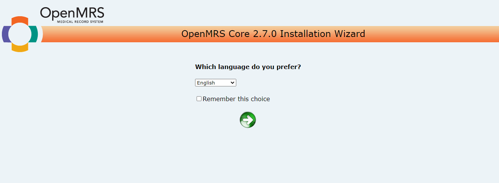

># open-mrs
***Lets find how  open-mrs works and  what are steps need to run application***


## lets Figure out the manual steps .
- Check on which port its execute/run
- create a ec2 instance and install Docker
- write a docker file and push that image to registry(dockerhub)
- install kubectl & eksctl 
- install terraform & aws cli
- set up eks cluster(elastic kubernates cluster) through terraform 
- deploy the application in pods
># installing docker in linux vm
###steps to follow
 ```bash
curl -fsSL https://get.docker.com -o get-docker.sh
sh get-docker.sh
 ```
 >### after installing docker add user to the group
```bash
sudo usermod -aG docker <user-name>
exit
```
## steps for dockerfile
>**DockerFile**
```
FROM maven:3-jdk-8 as mvn
LABEL author='Khaja'
RUN git clone https://github.com/openmrs/openmrs-core.git && cd openmrs-core && mvn clean package
 
FROM tomcat:8
LABEL author='Khaja'
COPY --from=mvn /openmrs-core/webapp/target/openmrs.war /usr/local/tomcat/webapps/openmrs.war
EXPOSE 8080
CMD ["catalina.sh", "run"]
```
>**building the docker image & pushing**
- Execute the commands for building image & pushing to the registry(dockerhub) 
```sh
docker image build -t jalasuresh/openmrs:1.0 .
```
- containerized the image 
```sh
docker container run -d -P jalasuresh/openmrs:1.0
```
- push the image from Docker to  Docker Registry

```
jalasuresh/openmrs:1.0
```
># set up the EKS Cluster 

- Install the AWS CLI into ec2 instance 
- steps for installing aws cli in linux vm following below
 ```bash
 ensure that unzip is installed otherwise excute this command(sudo install unzip -y)
 curl "https://awscli.amazonaws.com/awscli-exe-linux-x86_64.zip" -o "awscliv2.zip"
unzip awscliv2.zip
sudo ./aws/install

&&
aws --version  (checking version)
aws configure (configure IAM user)
give access key & secreate key
 ``` 
>## kubectl install 
- kubectl installing steps following below
```bash
curl -o kubectl https://s3.us-west-2.amazonaws.com/amazon-eks/1.22.15/2022-10-31/bin/linux/amd64/kubectl
&&
chmod +x ./kubectl
&&
mkdir -p $HOME/bin && cp ./kubectl $HOME/bin/kubectl && export PATH=$PATH:$HOME/bin
&&
echo 'export PATH=$PATH:$HOME/bin' >> ~/.bashrc
&&
kubectl version 
```
>## EKSCTL install 
- eksctl installing steps following below
```bash
curl --silent --location "https://github.com/weaveworks/eksctl/releases/latest/download/eksctl_$(uname -s)_amd64.tar.gz" | tar xz -C /tmp
&&
sudo mv /tmp/eksctl /usr/local/bin
&&
eksctl version
```
- To set up eks cluster we would be using terraform  as through we using k8's cluster
>## Install terraform on ec2
- for installing terraform use the below commands
```bash
cd ~/bin or cd /home/ubuntu/bin based on user
     sudo apt-get update && sudo apt-get install -y gnupg software-properties-common
    
     wget -O- https://apt.releases.hashicorp.com/gpg | gpg --dearmor | sudo tee /usr/share/keyrings/hashicorp-archive-keyring.gpg
    
     gpg --no-default-keyring --keyring /usr/share/keyrings/hashicorp-archive-keyring.gpg --fingerprint
    
     echo "deb [signed-by=/usr/share/keyrings/hashicorp-archive-keyring.gpg] \
     https://apt.releases.hashicorp.com $(lsb_release -cs) main" | \
     sudo tee /etc/apt/sources.list.d/hashicorp.list
    
     sudo apt update
     sudo apt-get install terraform -y
     terraform --version
```
- Creating EKS cluster from terraform 
- after installing the terraform use the following commands 
```
git clone https://github.com/hashicorp/learn-terraform-provision-eks-cluster
cd learn-terraform-provision-eks-cluster
terraform init
terraform apply -auto-approve
aws eks --region $(terraform output -raw region) update-kubeconfig \
    --name $(terraform output -raw cluster_name) 
```
>## write a k8's  Manifest for Deployment
- write a Deployment manifestfile for game of life
```yaml 
---
apiVersion: apps/v1
kind: Deployment
metadata:
  name: openmrs-deploy
spec:
  minReadySeconds: 4
  replicas: 2
  selector:
    matchLabels:
      app: openmrs
  strategy:
    rollingUpdate:
      maxSurge: 25%
      maxUnavailable: 25%
  template:
    metadata:
      name: openmrs
      labels:
        app: openmrs
        ver: "1.0"
    spec:
      containers:
        - name: openmrs
          image: jalasuresh/openmrs:1.0
          ports:
            - containerPort: 8080
              protocol: TCP
```


* now create (or) apply the k8's mainfest in cluster by using this commands
```
kubectl apply -f <filename>.yaml
```

* for check the pods are running or not use this commands    
```
kubectl get po
```


>### now create a service to expose outside:-
- write a service file for expose the application as shown below 
```yaml
---
apiVersion: v1
kind: Service
metadata:
  name: svc-openmrs
spec:
  type: LoadBalancer
  selector:
    app: openmrs
  ports:
    - name: gol
      protocol: TCP
      port: 80
      targetPort: 8080
```
* lets execute the following the commands
```
 kubectl apply -f <filename>.yaml
 kubectl get svc
 ```
 
* after executing the command get's an External Ip then copy the extenal IP and goto google
 >* now search on google as below 
 ```
 http://<external-ip>:<port>/gameoflife
 ```
 